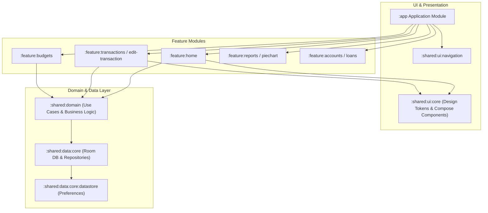

# Ivy Wallet (Personal Edition) 💸

[](https://github.com/saurav-gritfeat/ivy-wallet/releases/latest)
[](https://github.com/saurav-gritfeat/ivy-wallet/actions/workflows/build.yml)
[](https://github.com/saurav-gritfeat/ivy-wallet/actions/workflows/release.yml)
[](https://github.com/saurav-gritfeat/ivy-wallet/actions/workflows/test.yml)
[](https://www.gnu.org/licenses/gpl-3.0)

A fast, private, and modern personal finance manager for Android built with **100% Kotlin** and **Jetpack Compose**. Engineered for offline privacy, clean design, and automated continuous delivery via GitHub Actions.

---

## 📥 Download & Install APK

You can download and install the app on your phone directly from GitHub without needing any developer tools:

* 🔗 **[Download Latest APK from Releases](https://github.com/saurav-gritfeat/ivy-wallet/releases/latest)**
* 📦 **[View All Releases & Assets](https://github.com/saurav-gritfeat/ivy-wallet/releases)**
* 🛠️ **[Download Continuous Integration Artifacts](https://github.com/saurav-gritfeat/ivy-wallet/actions/workflows/build.yml)** (built on every commit)

---

## 📱 Features

- **Personal Finance Tracking**: Track income, expenses, account balances, and budgets with instant reactive updates.
- **Modern Jetpack Compose UI**: Smooth animations, Material 3 design system, and custom pie charts & spending trends.
- **Privacy & Local-First Persistence**: All data stored locally using Room DB (SQLite) and DataStore with zero mandatory cloud lock-in.
- **Multi-Account & Currency Support**: Easily switch between accounts, categories, and exchange rates.
- **Planned Payments & Recurring Budgets**: Organize upcoming payments, loan tracking, and monthly allowances.
- **Automated CI/CD Workflows**: Direct cloud compilation and release generation via GitHub Actions — install directly on your device without local build toolchains.

---

## 🏗️ Architecture & Tech Stack



| Layer | Technologies |
| :--- | :--- |
| **Language & Concurrency** | 100% Kotlin, Kotlin Coroutines, Kotlin Flow |
| **UI Framework** | Jetpack Compose, Material 3, Compose Navigation |
| **Dependency Injection** | Hilt / Dagger, KSP |
| **Database & Persistence** | Room DB (SQLite ORM), AndroidX DataStore |
| **Networking & Serialization** | Ktor Client, Kotlinx Serialization |
| **Functional Utilities** | ArrowKt |
| **Unit Testing** | JUnit4, Kotest Assertions, MockK, Coroutines Test |
| **Build & CI/CD** | Gradle Kotlin DSL (`build.gradle.kts`), GitHub Actions (Temurin JDK 17) |

---

## 🚀 Cloud Build & Release Guide

### 1. Download Development Builds (Every Commit)
Every push to `main` automatically triggers the **Build APK** workflow. When it finishes:
1. Go to the **Actions** tab $\rightarrow$ **Build APK**.
2. Click on the latest run.
3. Scroll down to **Artifacts** and download `ivy-wallet-debug`.

### 2. Publish an Official Release Tag
To create a published GitHub Release with the downloadable `.apk` files attached:
```bash
git tag v1.0.0
git push origin v1.0.0
```
Or navigate to the **Actions** tab on GitHub $\rightarrow$ select **Release APK** $\rightarrow$ click **Run workflow**.

---

## 🗺️ Roadmap & Personal Extensions

- [x] Automated GitHub Actions Build & Release Workflows
- [ ] On-Device SMS & Bank Notification Ingestion Service
- [ ] Intelligent Merchant Extraction & Auto-Categorization
- [ ] On-Device Financial Insights / Copilot (LiteRT / MediaPipe LLM)
- [ ] Automated Backup & Export Sync

---

## 📄 License

This project is licensed under the [GNU General Public License v3.0 (GPL-3.0)](LICENSE).
